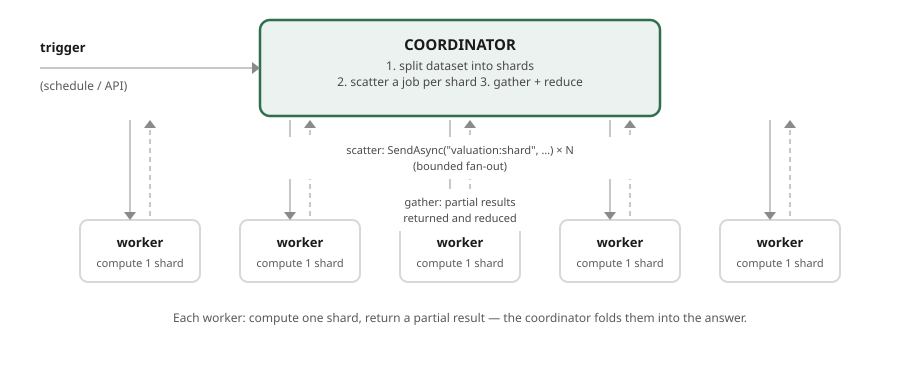

# Map-Reduce & High-Volume Compute

**Status: DRAFT v0.1 — part of the [Patterns](index.md) "at enterprise scale" set.**

Some enterprise workloads are not "handle a request" but "**calculate over a very large dataset,
fast**" — revalue a book of a million positions at end of day, run a risk simulation across
thousands of scenarios, reprice a portfolio when the curve moves, score a batch of transactions.
The shape that fits is **map-reduce / scatter-gather**: split the work into independent shards, run
them in parallel across many workers (the *map*), and combine the results (the *reduce*).

Benzene supports this two ways: **compose it** from the parts (the bounded fan-out helper + your
fold), or reach for the packaged **`Benzene.MapReduce`** helper (`ScatterGatherAsync`), which wraps
exactly that composition. This document is honest about which parts are built-in and which you
assemble, works an **end-of-day portfolio risk** calculation through the explicit composition, and
then shows the one-call helper form that does the same thing.

---

## What's built-in, what you compose

Be clear-eyed about this up front — it is the difference between using the framework and fighting it:

| Piece | Status |
|---|---|
| **Scatter** — dispatch N units of work concurrently | **Composed** — `Task.WhenAll` over `SendAsync` (to core services / Lambdas), or concurrent Lambda-to-Lambda invokes. Ordinary async fan-out; the sender is stateless per call. |
| **Bounded parallelism** — a cap on how many run at once | **Built-in helper** — `BoundedFanOut.WhenAllAsync(source, body, maxDegreeOfParallelism)` (semaphore-gated `Task.WhenAll`, results in source order); `ConcurrentRequests` + `BoundedConcurrentDispatcher` on self-hosted workers. |
| **One message → many transports** | **Built-in** — `UseParallel((..),(..))` on an outbound route, all-must-succeed. Fan-out *publish*, not scatter-gather of distinct work. |
| **A fixed, heterogeneous parallel step set with rollback** | **Built-in** — a [saga](orchestrators.md#the-saga-pattern) *stage* runs its steps concurrently (`Task.WhenAll`) and compensates on failure. |
| **Reduce** — aggregate the workers' results | **You own the fold** — write it directly, or pass it to `Benzene.MapReduce`'s `ScatterGatherAsync`, which runs the scatter (bounded fan-out) and your reduce together under a `PartialFailureMode` policy. |
| **Scatter + reduce as one call** | **Packaged helper** — `Benzene.MapReduce`'s `IBenzeneMessageSender.ScatterGatherAsync(topic, shards, seed, reduce, options?)` composes the two rows above so you don't hand-roll them each time. |

So: **the map is a bounded fan-out; the reduce is a fold you own.** Benzene supplies the transport,
the topic addressing, the bounded-concurrency helper, and (for a fixed step set) the saga. You can
wire the scatter and the reduce yourself, or reach for the small `Benzene.MapReduce` helper that
packages exactly that — the rest of this document shows the explicit composition first so you can see
what the helper does.

---

## The shape

A **coordinator** service owns the map-reduce; the **workers** are ordinary Benzene services (or
Lambdas) that each compute one shard:



- **Map (scatter):** the coordinator issues one request per shard, concurrently, with a
  concurrency cap so it doesn't open ten-thousand simultaneous invocations.
- **Reduce (gather):** each worker returns a partial result (a sub-total, a partial risk vector);
  the coordinator folds them into the final answer.
- **Workers are stateless and independent** — the property that lets them scale horizontally and
  retry individually. Each is transport-neutral: run it as a Lambda for burst parallelism, or as a
  container for steady load, without changing its handler.

### Two-level scatter for very large fan-out

At a million positions, one coordinator issuing a million calls is itself a bottleneck. Shard
**hierarchically**: the coordinator scatters to a modest number of **partition workers** (say, one
per book or per asset class), and each partition worker scatters again over *its* slice and reduces
locally, returning a partial to the coordinator's final reduce. Fan-out becomes a tree; each level
stays a bounded fan-out. This is the serverless equivalent of a map-reduce shuffle, assembled from
the same `SendAsync` + fold at each level.

---

## How you build it with Benzene

### Scatter with a concurrency cap

*(informative, .NET)* The map is a bounded parallel fan-out — `BoundedFanOut.WhenAllAsync` keeps the
in-flight count under a ceiling and returns results **in source order**, so the reduce is
deterministic:

```csharp
// shards: the dataset split into independent units of work
var partials = await BoundedFanOut.WhenAllAsync(
    shards,
    shard => _sender.SendAsync<ValueShard, ShardResult>("valuation:shard", shard),
    maxDegreeOfParallelism: 64);

var total = partials
    .Where(p => p.IsSuccessful)
    .Aggregate(RiskVector.Zero, (acc, p) => acc + p.Payload);   // the reduce — your fold
```

On AWS the worker call resolves to a **Lambda-to-Lambda** invoke ([service communication](service-communication.md)):
cheap, fast, and burst-parallel — a thousand shards become a thousand concurrent Lambdas, each
billed only for its own runtime. For a genuinely uniform "same calculation over a partitioned
collection", that burst model is Benzene's sweet spot.

### The same thing, packaged: `Benzene.MapReduce`

*(informative, .NET)* When you don't want to hand-wire the scatter and the fold each time, the small
`Benzene.MapReduce` package does exactly the above in one call — bounded-fan-out scatter, then your
reduce, under an explicit failure policy:

```csharp
// scatter shards to "valuation:shard", fold each ShardResult into a RiskVector
var result = await _sender.ScatterGatherAsync<ValueShard, ShardResult, RiskVector>(
    "valuation:shard",
    shards,
    seed: RiskVector.Zero,
    reduce: (acc, partial) => acc + partial,           // your fold
    new ScatterGatherOptions { MaxDegreeOfParallelism = 64 });

var total = result.Value;
```

The default `PartialFailureMode.ThrowOnAnyFailure` means an incomplete total is never silently
treated as complete; switch to `BestEffort` to reduce over the successes and read the dropped shards
off `result.FailedShards` (with `result.IsComplete` telling you whether coverage was full). It is a
thin composition of the parts above — nothing you couldn't write, packaged so you don't rewrite it.

### The worker

A worker is a normal handler — one shard in, one partial out:

```csharp
[Message("valuation:shard")]
public class ValueShardHandler : IMessageHandler<ValueShard, ShardResult>
{
    public Task<IBenzeneResult<ShardResult>> HandleAsync(ValueShard shard)
        => Task.FromResult(BenzeneResult.Ok(Revalue(shard.Positions, shard.MarketData)));
}
```

### Handling partial failure

Fan-out at scale *will* have stragglers and failures. Two honest options, and the choice is a
business decision:

- **All-or-nothing:** if any shard fails, the whole calculation is invalid (a regulatory number that
  must be complete). Model the map-reduce as a **saga** so a failure compensates/aborts the run
  cleanly, or fail the coordinator and let the trigger re-run it.
- **Best-effort with retry:** retry failed shards (`.UseRetry(n)` on the worker route), and only
  fail the run if a shard is still failing after its budget. Idempotent workers
  ([`UseIdempotency`](choreography.md#reliability-at-least-once-so-make-reactions-idempotent)) make
  retries safe. Report which shards were retried so the number's provenance is auditable.

Never silently drop a failed shard into the reduce — a partial total presented as complete is the
worst outcome. If coverage was reduced, the result must say so.

---

## Worked example: end-of-day portfolio risk

**The system:** each evening, revalue and risk-assess a book of ~1M positions against the day's
closing curves, produce the firm's risk numbers, and store them for reporting and regulatory
submission.

1. **Trigger.** A schedule fires the **risk coordinator** (a Benzene service behind a timer trigger).
2. **Split.** The coordinator partitions the book by *portfolio* into a few hundred shards (a shard
   sized so a worker finishes in seconds).
3. **Scatter.** It fans out `SendAsync("risk:shard", shard)` under a `BoundedFanOut` cap of, say, 128
   — a few hundred Lambda workers run concurrently, each revaluing its portfolio against the curves.
4. **Workers compute.** Each `risk:shard` handler revalues its positions and returns a partial risk
   vector (P&L, greeks, VaR contributions). Workers are stateless and idempotent, so a retried shard
   is safe.
5. **Reduce.** The coordinator folds the partial vectors into the firm-level risk — deterministically,
   because `BoundedFanOut` returns results in shard order.
6. **Persist + publish.** The final numbers are written (they become the authoritative end-of-day
   figures) and a `risk:completed` event is emitted — from which a
   [reporting read model](cqrs-read-models.md) projects the regulatory views and an
   [event-sourced ledger](event-sourcing.md) records the run for audit.

The whole thing is minutes of wall-clock for a job that is hours if run serially — because the map
is a burst of hundreds of independent Lambdas — and every part of it is an ordinary Benzene handler
plus a fold you own.

---

## When to use it

- **Use it** for large, **partitionable** computations where the work per shard is independent and
  the results combine — batch revaluation, scenario/Monte-Carlo risk, bulk scoring, report
  generation over a big dataset.
- **Don't** use it when the computation is **not partitionable** (each step depends on the previous —
  that is a sequential pipeline, or a [stream](streaming-processing.md) if it's ordered records), or
  when the dataset is small enough that one worker handles it (the fan-out overhead isn't worth it).

---

## Checklist

Map-reduce is well-formed when:

- [ ] Work is split into **independent shards** sized for a few seconds each.
- [ ] Scatter is a **bounded** fan-out (`BoundedFanOut` / a concurrency cap), not an unbounded
      `Task.WhenAll` over everything.
- [ ] Workers are **stateless and idempotent**, so shards retry safely.
- [ ] The **reduce is a deterministic fold** you own (results in shard order).
- [ ] Partial failure has an explicit policy (**all-or-nothing** vs **best-effort + retry**); a
      reduced-coverage result **says so**.
- [ ] Very large fan-outs shard **hierarchically** (a tree of bounded fan-outs).

See also: [service communication](service-communication.md) (the Lambda-to-Lambda calls the scatter
rides on) and [stream processing](streaming-processing.md) (for ordered, rolling computations rather
than batch fan-out).
