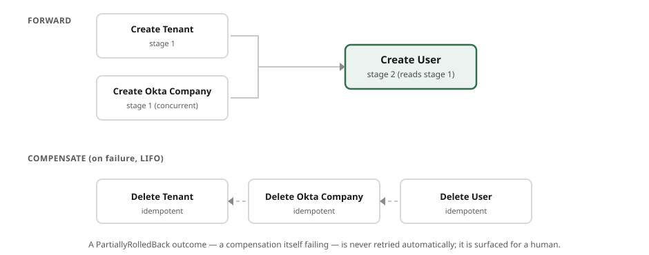

# Orchestrators

**Status: DRAFT v0.1 — part of the [two-tier pattern](two-tier-architecture.md).**

An **orchestrator** owns a business *process*. Where a [core service](core-services.md) is a
guarded database, an orchestrator is a coordinator: it takes a request or an event, drives a
sequence of operations across several core services, emits events about what happened, and makes
the whole multi-service change **atomic** — it either fully succeeds or is fully undone.

Orchestrators are where the business logic of the system lives. Core services are deliberately
dumb so that orchestrators can be the one place a process is expressed, changed, and understood.

---

## What an orchestrator is

- **Triggered by a request or an event.** An orchestrator's front door is any Benzene transport:
  an API Gateway request (request/response), a queue or topic message (SQS, SNS, EventBridge), a
  schedule, a stream. The same orchestrator logic can sit behind more than one — see
  [Triggers](#triggers).
- **Drives a process across core services.** Its steps are calls to core-service topics —
  `tenant:create`, `user:create`, `billing:setup` — composed into a business process. It reads
  from and writes to several aggregates that no single core service may touch together.
- **Emits events.** On completion (and often on failure) an orchestrator publishes an event —
  `signup:completed`, `signup:failed` — for the rest of the estate to react to. This is how
  processes chain without orchestrators depending on each other directly.
- **Owns little or no persistent state.** The system of record is the core services. An
  orchestrator is ideally stateless between invocations; what state it does hold is the
  *transient* state of an in-flight process (a [saga](#the-saga-pattern)'s progress), which exists
  only until the process finishes or is compensated.
- **Makes multi-service writes all-or-nothing.** This is the non-negotiable one, and it is what the
  rest of this document is about.

---

## Triggers

An orchestrator is transport-neutral in exactly the way every Benzene service is
([core-concepts.md](../specification/core-concepts.md#1-the-model-in-one-paragraph)): the
process logic is written once, and one or more transport adapters feed it. Two broad shapes:

- **Request/response** — an API call comes in, the orchestrator runs the process synchronously and
  returns a result (`201 Created` with the new ids, or a `validation-error`/`conflict`/`service-unavailable`
  result). The caller waits for the whole process.
- **Event-driven / fire-and-forget** — a message arrives (a queue item, a published event, a
  schedule firing), the orchestrator runs the process and **emits events** rather than returning to
  a caller. Nobody is waiting on the wire; the outcome is communicated by the events it publishes.

The same process can be exposed both ways. What differs is only the adapter at the edge and whether
a result is returned or an event is emitted — the process in the middle is identical.

Because the outcome of an event-driven process is only visible through its emitted events, an
orchestrator should emit on **failure** as deliberately as on success: a `signup:failed` event with
a reason is how the rest of the system (and your operators) learn that a fire-and-forget process
rolled back.

---

## The saga pattern

The core services each write atomically to their own database. But a business process usually
writes to **several** of them — create a tenant, create its admin user, set up billing — and there
is no distributed transaction across three databases. If the second write fails, the first is
already committed. The saga pattern is how an orchestrator gets **atomicity across services**
anyway: not by holding a lock, but by pairing every forward action with a **compensation** that
undoes it, and running the compensations in reverse if anything fails.

The invariant the orchestrator guarantees: **total success, or total rollback — never a
half-applied process.** A signup that fails at billing must leave no orphan tenant and no orphan
user behind.

### Shape *(informative, .NET — `Benzene.Saga`)*



A saga is an ordered list of **stages**; each stage is a group of **steps that run concurrently**;
stages run in order, threading their results through a shared context. Each step is a **forward
action** paired with the **compensation** that undoes it:

```csharp
var saga = new SagaBuilder()
    .Stage(stage => stage
        .Step<TenantCreated>(step => step
            .Do(_       => api.CreateTenantAsync(companyName))
            .Compensate((_, tenant) => api.DeleteTenantAsync(tenant.TenantId)))
        .Step<OktaCompanyCreated>(step => step
            .Do(_        => api.CreateOktaCompanyAsync(companyName))
            .Compensate((_, company) => api.DeleteOktaCompanyAsync(company.CompanyId))))
    .Stage(stage => stage
        .Step<UserCreated>(step => step
            // later stages read earlier results from the shared context
            .Do(ctx => api.CreateUserAsync(ctx.Get<TenantCreated>().TenantId, email))
            .Compensate((_, user) => api.DeleteUserAsync(user.UserId))))
    .Build();

var result = await saga.RunAsync();
```

The engine's contract:

- **Stages run in order; steps within a stage run concurrently.** Independent effects (create the
  tenant *and* the Okta company) parallelize; dependent effects (create the user, which needs the
  tenant id) go in a later stage that reads the earlier result from the context.
- **On any failure, every completed effect is compensated in reverse (LIFO) order.** If stage 2
  fails, stage 1's tenant and Okta company are deleted — newest effect undone first. The process
  ends wholly rolled back.
- **A succeeded step with no compensation is "nothing to undo"** — pure reads or idempotent effects
  need no `Compensate`. Compensation only ever runs for a step that actually succeeded.
- **Each step's `Do` is a call to a core service.** In production the forward action is a Benzene
  request/response call — `send("tenant:create", req)` — and its compensation is another topic call
  (`send("tenant:delete", …)`). The saga is the *orchestration*; the core services do the *work*.
  See [service-communication.md](service-communication.md) for how those calls are addressed and
  routed.

### Outcomes and durability

Running a saga yields one of three outcomes, and the difference between the last two matters:

| Outcome | Meaning |
|---|---|
| `Succeeded` | Every step completed; the process is applied. |
| `RolledBack` | A step failed and **every** compensation succeeded — the system is clean, as if nothing happened. |
| `PartiallyRolledBack` | A step failed **and a compensation also failed** — some effect may still be applied. This needs attention: it is the one state the invariant could not fully restore. |

*(informative, .NET)* `Saga.RunAsync(SagaRunOptions)` can attach a durable `ISagaStateStore` (so an
interrupted saga can be recovered) and a `SagaRetryPolicy`. The retry rule is deliberately
conservative: only a **clean** `RolledBack` outcome is retried — a `PartiallyRolledBack` one, which
may have left effects behind, is **never** retried automatically, because retrying on top of a
possibly-applied effect is how you double-charge a customer. A `PartiallyRolledBack` is surfaced
(emit a failure event, alert) for a human or a dedicated repair process to resolve.

### Designing compensations

The saga is only as atomic as its compensations. Rules that keep it honest:

- **Every effectful forward step has a compensation.** If you cannot write one, question whether the
  step belongs in the saga — or make the effect idempotent and externally reversible first.
- **Compensations must be idempotent.** A compensation may run after a partial failure and may be
  retried; deleting an already-deleted tenant must be a no-op success, not an error.
- **Prefer reversible effects over irreversible ones inside a saga.** Sending an email or charging
  a card is hard to compensate; where possible, stage irreversible effects last (so everything that
  could fail has already succeeded) or move them out of the atomic process entirely and drive them
  from the success event.
- **Order effects so the most likely failure is cheapest to undo.** Cheap, easily-reversed writes
  early; expensive or externally-visible effects late.

---

## Orchestrators and the mesh

An orchestrator is a Benzene service like any other and should target the
[Cloud Service Profile](../specification/cloud-service-profile.md) too — its handlers,
health, and mesh feeds make the *process* layer as visible as the data layer. Because orchestrators
are the services that call across the fleet, their trace-context propagation
([R8](../specification/cloud-service-profile.md)) is what draws
the **edges** in the mesh topology: "the signup orchestrator calls tenant:create, user:create, and
billing:setup" is derived from the traces the orchestrator propagates, not declared anywhere. Keep
propagation on and the mesh shows your business processes as real, observed call graphs.

---

## Checklist

A service is a well-formed orchestrator when:

- [ ] It owns a **business process**, not an aggregate's data.
- [ ] It is **stateless between invocations** except for transient in-flight saga state.
- [ ] Its steps are **calls to core-service topics**, addressed by topic (see
      [service-communication.md](service-communication.md)).
- [ ] Every **multi-service write is a saga** with a compensation for every effect.
- [ ] Compensations are **idempotent**; irreversible effects are staged last or moved out of the
      atomic process.
- [ ] It **emits events** on success *and* failure.
- [ ] It **propagates trace context** so the mesh derives its process edges.
- [ ] It targets the **[Cloud Service Profile](../specification/cloud-service-profile.md)**.

Next: how the calls between orchestrators and core services are addressed, routed, and realized on
AWS — **[service communication](service-communication.md)**.
