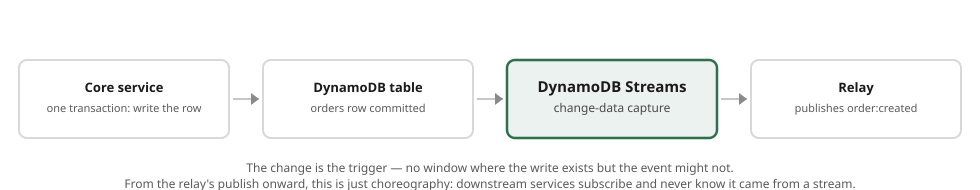

# The Transactional Outbox

**Status: DRAFT v0.1 — part of the [Patterns](index.md) "composing a system" set.**

[Choreography](choreography.md) and [read models](cqrs-read-models.md) both stand on one
assumption: that the events a service emits are **actually emitted, exactly when its data
changed**. This document is about earning that assumption. It solves the **dual-write problem** —
the reason a naïve "write the row, then publish the event" is quietly unreliable — and shows the
near-zero-code way to do it on Benzene with change-data-capture.

---

## The dual-write problem

A service that owns data and emits events has to do two things when something happens: **commit the
write** to its database, and **publish the event** to SNS/EventBridge. Those are two different
systems with no shared transaction, so a handler that does them in sequence has a gap:

```csharp
await _store.InsertAsync(order);              // (1) committed
await sender.SendAsync("order:created", evt); // (2) crash here → the write is real, the event never happened
```

Crash — or a network blip, or a throttle — **between** (1) and (2) and you have a committed order
that nothing downstream will ever hear about. Reverse the order and you get the opposite bug: a
published `order:created` for an order the write never committed (a **phantom event**). At-least-once
delivery does not help; the problem is the emit not happening at all, or happening for a write that
didn't. You cannot close this gap by trying harder in the handler — the two systems will never share
a commit.

The fix is to stop treating the event as a second action, and make it a **consequence of the
committed write**.

---

## The pattern

Record the intent-to-publish **in the same transaction as the data**, then let a separate relay turn
that durable record into a published event. Because the record and the data commit together, the
event is emitted **if and only if** the write committed — no gap, no phantom.

There are two shapes; on Benzene the first is almost free.

### Shape 1 — Change data capture (the near-zero-code form)



If the domain store *is* the log of changes, you need no separate outbox table at all: capture the
change stream off the domain table and publish from it. On AWS that is **DynamoDB Streams**, and
Benzene has a first-class inbound transport for it.

Point a stream at the table, and run a small **relay** service whose handlers are the table's change
events. Benzene surfaces each change as the topic `"{tableName}:{eventName}"`:

*(informative, .NET)*

```csharp
app.UseAwsLambda(events => events
    .UseDynamoDb(cdc => cdc.UseMessageHandlers()));

[Message("orders:INSERT")]                         // table "orders", a new item
public class PublishOrderCreated : IMessageHandler<OrderRow>
{
    private readonly IBenzeneMessageSender _sender;
    public PublishOrderCreated(IBenzeneMessageSender sender) => _sender = sender;

    public async Task<IBenzeneResult> HandleAsync(OrderRow row)
    {
        // The row is the committed NewImage, unmarshalled to a plain object.
        var evt = new OrderCreated { OrderId = row.Id, Total = row.Total };
        await _sender.SendAsync<OrderCreated, Void>("order:created", evt);   // → EventBridge/SNS
        return BenzeneResult.Ok();
    }
}
```

What Benzene gives you here:

- **The change *is* the trigger.** The handler runs because the row committed; there is no window in
  which the write exists but the event might not.
- **The committed image, as a plain object.** The body is the record's `NewImage` (falling back to
  `OldImage` for `REMOVE`, then `Keys` for keys-only streams), unmarshalled from DynamoDB's
  attribute-value format into ordinary JSON — your handler deserializes a normal type, not a raw
  stream record. Stream metadata (`dynamodb-table`, `dynamodb-event-name`, `dynamodb-sequence-number`,
  …) arrives as `dynamodb-`-prefixed headers.
- **At-least-once emission, guaranteed.** DynamoDB Streams are **shard-ordered**, and Benzene
  processes the batch **sequentially, stopping at the first failure** and reporting that record's
  sequence number as a partial-batch failure — so Lambda checkpoints there and **redelivers from the
  failed record**. If the publish in (2) fails, the relay simply re-runs from that change until it
  succeeds. The event cannot be lost. (This is deliberately unlike the SQS adapter's concurrent
  fan-out — CDC is ordered because change order matters.)

The publish out of the relay is an ordinary [outbound route](service-communication.md#the-routing-table)
(`SendAsync` → `UseEventBridge`/`UseSns`), so from here on it is just [choreography](choreography.md):
downstream services subscribe to `order:created` and never know it came from a stream.

### Shape 2 — An explicit outbox table

When the store isn't change-captured, or the event is not a 1:1 image of a row (it aggregates
several writes, or carries a shape the row doesn't), write an explicit **outbox** record in the same
transaction as the data:

1. In one transaction, write the domain change **and** an `outbox` record (`{topic, payload,
   status: pending}`).
2. A relay reads pending outbox records — by change-capturing the *outbox* table (Shape 1 applied to
   the outbox), or by polling it — and for each one calls `SendAsync(topic, payload)`, then marks it
   `published`.
3. Because publish→mark is itself at-least-once, a record may be published twice; that is expected
   and handled downstream (below).

Shape 2 is the portable form (any transactional store); Shape 1 is the one to reach for first on
DynamoDB, because Benzene's CDC transport makes the relay a handful of lines.

---

## The other half: idempotent consumers

An outbox guarantees **at-least-once emission** — a checkpoint retry or a re-read can republish the
same event. It deliberately does **not** guarantee exactly-once; that is not achievable across
systems. The end-to-end "each event takes effect once" is completed on the **consumer** side, by
making reactions idempotent — exactly the discipline [choreography](choreography.md#reliability-at-least-once-so-make-reactions-idempotent)
already calls for. `Benzene.Idempotency`'s `UseIdempotency()` plus a distributed store (a DynamoDB
conditional write, a Redis `SET NX`) turns at-least-once delivery into once-effective processing.

Outbox (reliable emission) + idempotent consumers (safe reprocessing) is the whole reliability
contract: **nothing lost, nothing double-applied.**

---

## When to use it

- **Use it** whenever a committed change *must* result in an event — the event drives money,
  fulfilment, or another service's state, and a lost event is a correctness bug. On DynamoDB, prefer
  the CDC form; it is cheap enough to be the default for domain tables.
- **You may skip it** for events that are advisory and self-healing (a cache warm that a later event
  will fix anyway), where an occasional miss is tolerable and the outbox's machinery isn't worth it.
  Be honest about which of your events are actually in that category — usually fewer than you'd think.

---

## Checklist

Reliable event publishing is in place when:

- [ ] No handler does a **write then a separate publish** and calls it reliable.
- [ ] The event is a **consequence of the committed write** — via a change stream (Shape 1) or an
      outbox record written in the data's transaction (Shape 2).
- [ ] The relay's emission is **at-least-once** and survives a failed publish (CDC checkpoint /
      outbox re-read).
- [ ] Consumers are **idempotent**, closing the loop to once-effective end to end.
- [ ] Change-captured relays respect **ordering** (sequential, checkpoint-on-failure), not
      concurrent fan-out.

See also: [choreography](choreography.md) (what consumes these events) and
[CQRS & read models](cqrs-read-models.md) (a consumer that depends on never missing one).
